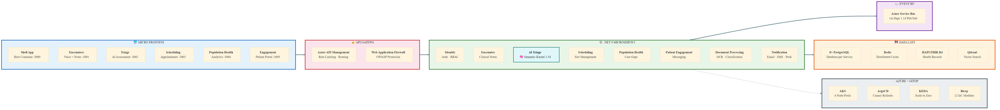
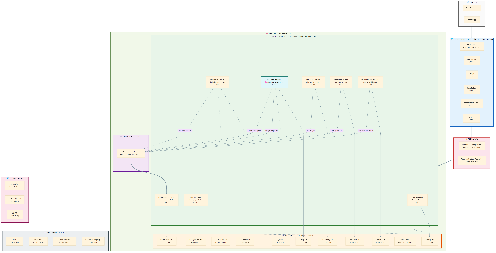

# Building a Production-Grade Cloud-Native Platform: Microservices & Micro Frontends That Work for Any Domain

One of the biggest misconceptions in enterprise software is that architecture patterns are domain-specific. They're not. The same cloud-native patterns that power fintech, logistics, e-commerce, and healthcare can be expressed through a single, well-designed reference architecture — you just swap the bounded contexts.

I've been building exactly that: a **domain-agnostic cloud-native platform** using microservices and micro frontends, with healthcare as the first reference implementation. Every architectural decision — from database-per-service isolation to AI-assisted workflows to zero-trust networking — translates directly to any regulated, data-intensive domain.

## The Problem

Modern enterprises — whether in healthcare, finance, insurance, supply chain, or government — face the same structural challenges:

- Multiple teams building features that need to deploy independently
- Strict data isolation and regulatory compliance (HIPAA, PCI-DSS, GDPR, SOX)
- Real-time event-driven workflows that must scale elastically
- AI capabilities that need guardrails, not free-form generation
- Infrastructure that must be reproducible, auditable, and cost-efficient

Monolithic architectures break under these demands. I wanted to prove that a single platform blueprint could address all of them — and that healthcare, one of the most demanding domains, could serve as the proving ground.

## Architecture

**High-level architecture:**

> Also available as [SVG](images/architecture-high-level.svg) · [Mermaid source](images/architecture-high-level.mmd)

**Detailed component view with event flows (healthcare reference implementation):**

> Also available as [SVG](images/architecture-overview.svg) · [Mermaid source](images/architecture-overview.mmd)

The architecture is layered so that domain logic is the only thing that changes between implementations. The gateway, event bus, infrastructure modules, CI/CD pipelines, observability, and micro frontend shell remain identical whether you're building for clinical workflows, trading platforms, or warehouse management.

## Technology Stack

### Backend

- **.NET 9 (C# 13)** with ASP.NET Core Minimal APIs — each service follows Clean Architecture with CQRS and the Transactional Outbox pattern
- **Microsoft Aspire 9.2** for local orchestration — one command starts all services, databases, caches, and supporting infrastructure
- **Microsoft Semantic Kernel 1.54** for AI-powered workflows with plugin-based LLM orchestration
- **Dapr 1.14** for portable pub/sub, state management, and secret management — making the services infrastructure-agnostic
- **OpenTelemetry 1.12** with distributed tracing across every service boundary

### Frontend

- **Vite 6** with **Module Federation** — each micro frontend is independently built and deployed, federated at runtime
- **React 19** with **MUI 6.4** for an accessible, WCAG 2.1 AA compliant UI
- **Turborepo** monorepo with 5 shared packages (design system, auth client, SignalR client, domain types, TypeScript configs)

### Infrastructure

- 12 **Bicep** modules for Azure IaC (AKS with 4 node pools, PostgreSQL Flexible Servers, Service Bus Premium, Redis, Key Vault)
- **ArgoCD** GitOps with **Argo Rollouts** canary deployments — gated on domain-specific quality metrics
- **KEDA** autoscaling — bursty workloads scale to zero when idle
- 11 **zero-trust network policies** with default deny-all
- 4 CI/CD pipelines with selective triggering — only changed services are rebuilt and deployed

## Key Design Decisions (and Why They're Domain-Agnostic)

### Database-per-Service Isolation

Every microservice owns its data exclusively. Cross-service communication happens only through domain events. This isn't just a healthcare/HIPAA requirement — it's essential for PCI-DSS in fintech, GDPR in any EU-facing product, and SOX in financial reporting. Data isolation is a universal compliance pattern.

### AI with Guardrails, Not Free-Form Generation

Semantic Kernel's plugin architecture lets you define structured functions that the LLM can invoke. In healthcare, this means clinical triage with human-in-the-loop escalation. In finance, it's fraud detection with analyst review. In logistics, it's route optimization with dispatcher override. The pattern is always the same: **AI assists, humans decide on critical paths.**

### Module Federation for Independent Deployment

Six teams can own six micro frontends. In healthcare, that's scheduling, voice encounters, and patient engagement. In e-commerce, it's catalog, checkout, and inventory. In fintech, it's trading, risk, and compliance dashboards. The shell app, shared design system, and auth client don't change — only the domain-specific modules do.

### Aspire for Local Orchestration

Running 8+ microservices locally used to require a 200-line Docker Compose file. With Aspire, one command launches everything with automatic service discovery and an observability dashboard. This benefit is the same regardless of what those services do.

### Event-Driven Architecture with Transactional Outbox

Domain events decouple services completely. The event names change (from `TranscriptProduced` to `OrderPlaced` to `TradeExecuted`), but the infrastructure — Service Bus, Dapr pub/sub, outbox pattern, idempotent consumers — stays identical.

## Adapting to Other Domains

| Healthcare (Current) | Fintech | E-Commerce | Logistics |
|---|---|---|---|
| Clinical Encounters | Trading Engine | Product Catalog | Route Planning |
| AI Triage | Fraud Detection | Recommendation AI | Demand Forecasting |
| FHIR Records | Transaction Ledger | Order Management | Shipment Tracking |
| Scheduling | Portfolio Mgmt | Inventory | Fleet Management |
| Population Health | Risk Analytics | Customer Analytics | Supply Chain Analytics |

**The platform blueprint stays the same. The bounded contexts are the variables.**

## What's Next

This initial commit represents the complete foundation — 268 files, 14 .NET projects, 33 unit tests, and a full infrastructure stack. The healthcare implementation serves as the reference, but the real value is the reusable architecture. Next steps include expanding test coverage, adding EF Core migrations, deploying to AKS, and building a second domain implementation to prove the portability.

If you're building cloud-native platforms in any domain — healthcare, fintech, e-commerce, logistics, government — I'd love to connect and exchange ideas.

**GitHub:** [github.com/imatiqul/healthq-copilot](https://github.com/imatiqul/healthq-copilot)
